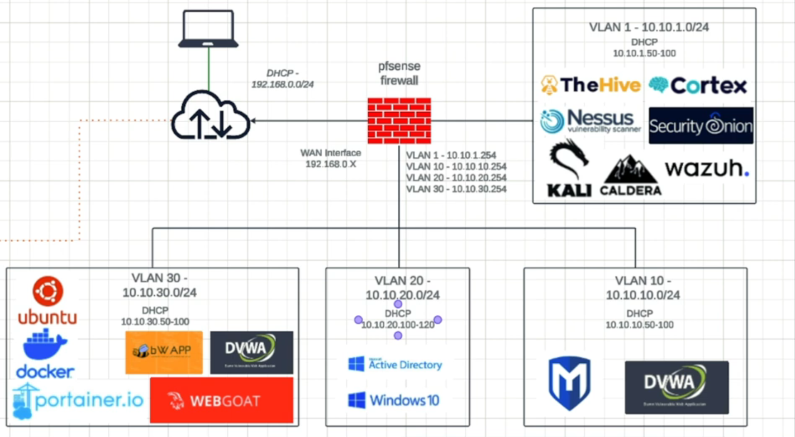

# 🛡️ Cybersecurity Home Lab (Red & Blue Team)

This project documents a fully isolated **cybersecurity home lab** built using **Proxmox VE** and **pfSense firewall**, designed for both **red team penetration testing** and **blue team monitoring**. It features segmented **VLANs**, multiple security tools, and simulated enterprise environments.

---

## 🏗️ Lab Architecture

The lab uses **pfSense** as a virtual firewall and Proxmox SDN (Software Defined Networking) for VLAN isolation.

### 🔐 pfSense Interface Setup

| Interface | Subnet            | Purpose                  |
|-----------|-------------------|--------------------------|
| WAN       | 192.168.0.X       | Internet access          |
| VLAN 1    | 10.10.1.0/24      | Blue team / SOC tools    |
| VLAN 10   | 10.10.10.0/24     | Red team targets         |
| VLAN 20   | 10.10.20.0/24     | Active Directory lab     |
| VLAN 30   | 10.10.30.0/24     | Web app targets / DevSec |

---

## 🖥️ Virtual Machines & Applications

### 🔹 VLAN 1 – 10.10.1.0/24 (Blue Team / SOC)
- DHCP Range: `10.10.1.50 – 10.10.1.100`
- Tools:
  - TheHive
  - Cortex
  - Nessus
  - Security Onion
  - Wazuh
  - Kali Linux
  - Caldera (MITRE ATT&CK automation)

---

### 🔸 VLAN 10 – 10.10.10.0/24 (Red Team Targets)
- DHCP Range: `10.10.10.50 – 10.10.10.100`
- Tools:
  - Metasploitable 3
  - DVWA (Damn Vulnerable Web App)

---

### 🔹 VLAN 20 – 10.10.20.0/24 (Windows Domain Lab)
- DHCP Range: `10.10.20.100 – 10.10.20.120`
- Tools:
  - Windows Server (Active Directory)
  - Windows 10 clients

---

### 🔸 VLAN 30 – 10.10.30.0/24 (Web Application & Docker)
- DHCP Range: `10.10.30.50 – 10.10.30.100`
- Tools:
  - Ubuntu (host)
  - Docker
  - Portainer.io
  - bWAPP
  - DVWA
  - WebGoat

---

## ⚙️ Technologies Used

- **Proxmox VE** for virtualization and VLAN-aware SDN
- **pfSense** for firewall, routing, and VLAN trunking
- **Open vSwitch (OVS)** for inter-VLAN routing within Proxmox
- **DHCP per VLAN** from pfSense interfaces
- **Isolated internal-only networking** (no external internet needed for attack emulation)

---

## 🎯 Goals

- Simulate real-world enterprise infrastructure
- Practice:
  - Network segmentation
  - Web application attacks
  - AD exploitation and detection
  - Blue team monitoring and correlation
- Build both offensive and defensive skillsets

---

## 🧠 Reference

Lab setup methodology inspired by:

▶️ **Tech with Gerard** – [YouTube Channel](https://www.youtube.com/@techwithgerard)

Highly recommended for anyone building a homelab using pfSense and Proxmox.

---

## 🖼️ Diagram

> Note: Topology Taken From Gerard's Video. I dont own this Image

---

## 👨‍💻 Author
**Mirza Areeb Baig**

Cybersecurity Enthusiast 
